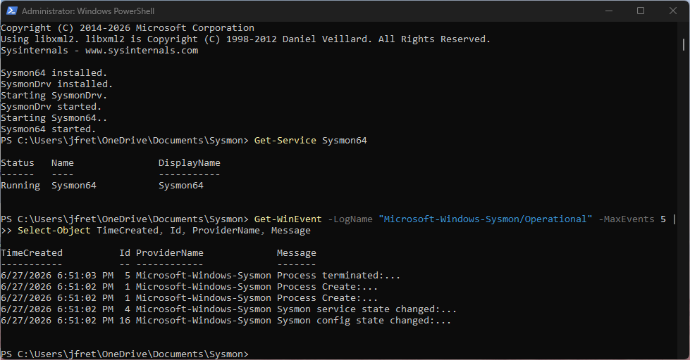
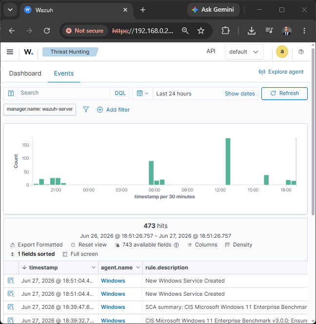
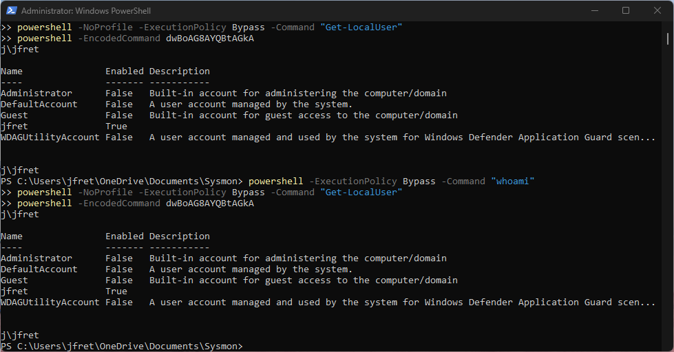
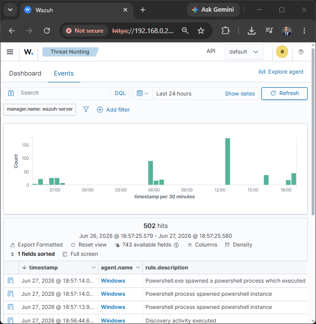

# Detection: Suspicious PowerShell Commands

## Objective

Detect suspicious PowerShell command execution on a Windows endpoint using Sysmon logs collected by Wazuh.

## Lab Setup

* SIEM: Wazuh
* Endpoint: Windows 11
* Attacker/Tester: Local Administrator PowerShell


## Test Commands

```bash
powershell -ExecutionPolicy Bypass -Command "whoami"
powershell -NoProfile -ExecutionPolicy Bypass -Command "Get-LocalUser"
powershell -EncodedCommand dwBoAG8AYQBtAGkA
powershell -NoProfile -WindowStyle Hidden -Command "Get-Process"
```

## Evidence

### PowerShell Sysmon Creation



### Wazuh Alert of Sysmon



### PowerShell Suspicious Commands



### Wazuh Alert of Suspicious Commands




## Security Relevance

Suspicious PowerShell commands may indicate various malicious activity, including user enumeration, bypass of restrictions, hidden execution, and more.

## Remediation

Validate whether the PowerShell activity was authorized, identify the user and parent process, review the full command line, investigate related Sysmon events, isolate the endpoint if malicious activity is confirmed, and tune Wazuh rules to reduce false positives.
