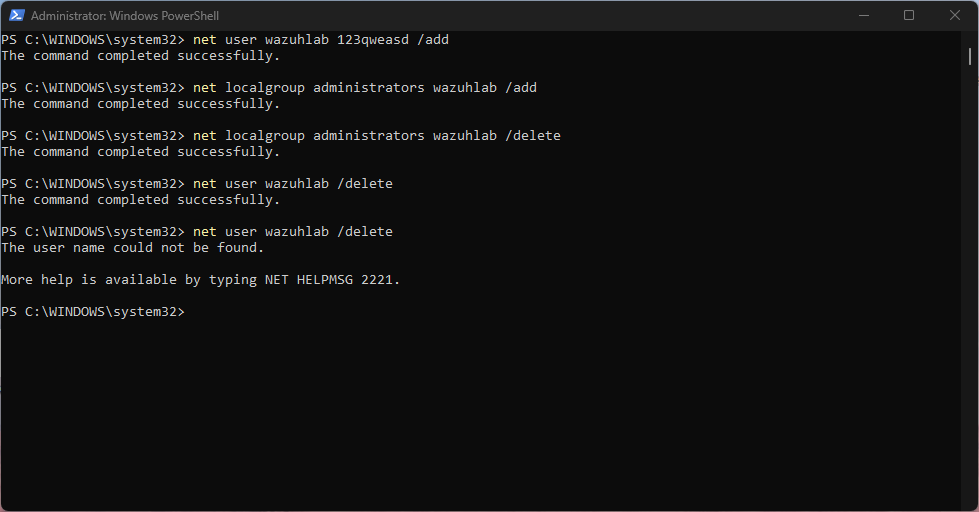
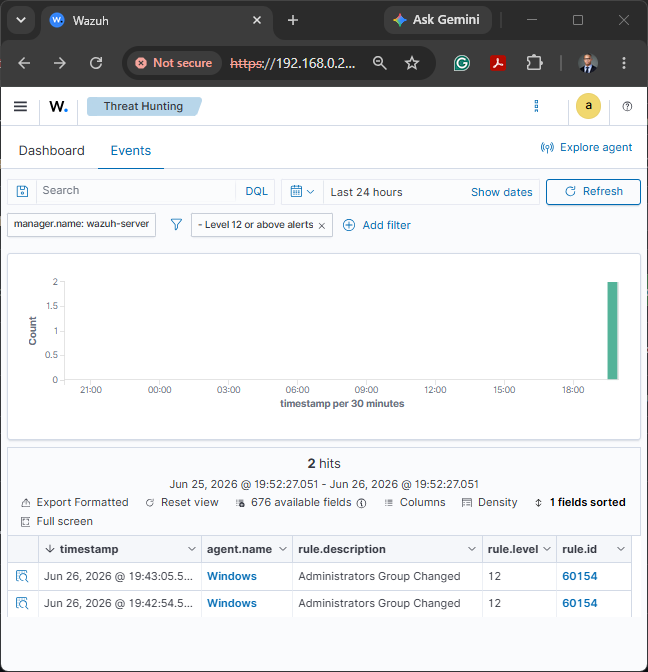

# Detection: Windows Local User Creation

## Objective

Detect account creation and admin group mod on Windows.

## Lab Setup

* SIEM: Wazuh
* Endpoint: Windows 11
* Attacker/Tester: Local Administrator PowerShell

## Test Commands

```bash
net user wazuhlab <temporary-lab-password> /add
net localgroup administrators wazuhlab /add
net localgroup administrators wazuhlab /delete
net user wazuhlab /delete
```

## Evidence

### PowerShell User Created



### Wazuh Alert of Added Admin



## Security Relevance

Unexpected account creation may indicate persistence, privilege escalation, or unauthorized access.

## Remediation

Review the creator, disable unauthorized accounts, rotate credentials, and investigate related login activity.
